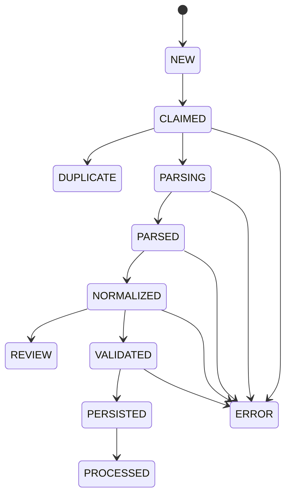

# Arquitectura de la POC

## 1. Principio rector

La arquitectura se basa en una separacion clara de responsabilidades:

- Python piensa y orquesta.
- LlamaParse parsea.
- IRIS registra y permite consultar.

Esta separacion baja complejidad, reduce acoplamiento y hace que la POC sea explicable, depurable y presentable.

## 2. Componentes

### 2.1 Worker Python externo

Responsable de:

- escaneo de carpeta;
- validación de estabilidad;
- claim del archivo;
- fingerprint;
- control de idempotencia;
- clasificación preliminar;
- integración con LlamaParse;
- normalización;
- validación;
- persistencia en IRIS;
- movimiento final del archivo;
- logging y manejo de errores.

### 2.2 LlamaParse v2

Responsable de:

- recibir el archivo por upload;
- ejecutar parsing;
- devolver JSON crudo y markdown parseado.

### 2.3 InterSystems IRIS Community

Responsable de:

- repositorio maestro de documentos;
- historial de intentos de parse;
- persistencia del documento normalizado;
- bitácora de eventos;
- registro de excepciones;
- soporte de consultas operacionales.

### 2.4 Filesystem del Mac mini

Responsable de:

- staging de entrada;
- control operacional por carpetas;
- almacenamiento de artefactos y evidencia de proceso.

## 3. Flujo extremo a extremo

1. El scanner revisa `In/` cada 30 a 60 segundos.
2. Filtra extensiones permitidas.
3. Verifica edad mínima del archivo.
4. Verifica tamano estable en dos lecturas.
5. Reclama el archivo moviendolo a `Processing/<uuid>/`.
6. Calcula `sha256`, MIME, tamano y metadata base.
7. Consulta si el hash ya existe en IRIS.
8. Si existe, registra evento, archiva duplicado y finaliza.
9. Si no existe, crea stub del documento en estado `CLAIMED`.
10. Clasifica preliminarmente el documento.
11. Llama a LlamaParse v2 por upload.
12. Guarda referencias del intento y artefactos crudos.
13. Normaliza a JSON canónico.
14. Ejecuta validación de campos mínimos.
15. Si falta información critica, marca `REVIEW`.
16. Si el resultado es valido, persiste `doc_normalized`.
17. Registra eventos y estado final.
18. Mueve el archivo a `Processed`, `Review` o `Error`.
19. Guarda artefactos en `Archive/YYYY/MM/DD/<sha256>/`.

## 4. Estructura de carpetas operativas

```text
/Users/christian/Google Drive/Adjuntos/
  In/
  Processing/
  Processed/
  Review/
  Error/
  Archive/
```

Estructura de archivo historico:

```text
Archive/YYYY/MM/DD/<sha256>/
  original.ext
  parse_raw.json
  parse.md
  normalized.json
  process.log
```

## 5. Estados del documento

### Estados principales

- `NEW`
- `CLAIMED`
- `PARSING`
- `PARSED`
- `NORMALIZED`
- `VALIDATED`
- `PERSISTED`
- `PROCESSED`

### Estados alternos

- `REVIEW`
- `ERROR`
- `DUPLICATE`

## 6. Maquina de estados



## 7. Modulos recomendados del worker

### `scanner.py`

- descubre candidatos en `In/`;
- filtra extensiones;
- aplica reglas de estabilidad.

### `claimer.py`

- hace move atomico a `Processing/<uuid>/`.

### `fingerprint.py`

- calcula `sha256`;
- obtiene tamano, MIME, nombre original y timestamps.

### `classifier.py`

- aplica reglas simples por nombre y keywords;
- sugiere tipo documental y tier de parse.

### `parse_client.py`

- encapsula upload, polling y recuperación de resultados de LlamaParse.

### `normalizer.py`

- transforma la salida de LlamaParse a esquema canónico.

### `validator.py`

- valida obligatoriedad minima por tipo documental;
- define `review_required`.

### `repository.py`

- concentra acceso DB-API a IRIS;
- maneja transacciones por documento.

### `orchestrator.py`

- coordina el flujo completo del documento;
- aplica reintentos y estado.

## 8. Esquema JSON canónico

```json
{
  "document_type": "invoice|receipt|card_statement|bank_statement|mutual_fund_statement",
  "issuer_name": "",
  "issuer_tax_id": "",
  "issue_date": "YYYY-MM-DD",
  "due_date": "YYYY-MM-DD",
  "period_from": "YYYY-MM-DD",
  "period_to": "YYYY-MM-DD",
  "currency": "CLP|USD|UF",
  "total_amount": 0,
  "balance_amount": 0,
  "account_ref_last4": "",
  "document_number": "",
  "confidence": 0.0,
  "review_required": false,
  "notes": ""
}
```

## 9. Validaciones minimas por tipo

### Factura o boleta

- `document_type`
- `issuer_name`
- `issue_date`
- `currency`
- `total_amount`

### Estado de tarjeta

- `document_type`
- `issuer_name`
- `period_from` o `period_to`
- `currency`
- `balance_amount` o `total_amount`
- `account_ref_last4`

### Cartola bancaria

- `document_type`
- `issuer_name`
- `period_from` o `period_to`
- `currency`

### Fondo mutuo

- `document_type`
- `issuer_name`
- `period_to` o `issue_date`
- `currency`

## 10. Modelo de persistencia IRIS

### `doc_document`

Registro maestro del archivo recibido.

Campos propuestos:

- `document_id`
- `attachment_hash`
- `original_filename`
- `source_path`
- `archive_path`
- `mime_type`
- `file_size_bytes`
- `source_email`
- `source_subject`
- `received_at`
- `current_status`
- `created_at`
- `updated_at`

### `doc_parse_attempt`

Historial de intentos de parsing.

Campos propuestos:

- `parse_attempt_id`
- `document_id`
- `provider`
- `provider_job_id`
- `provider_tier`
- `provider_version`
- `started_at`
- `completed_at`
- `outcome`
- `raw_json_path`
- `raw_markdown_path`
- `error_code`
- `error_message`

### `doc_normalized`

Vista relacional del documento procesado.

Campos propuestos:

- `document_id`
- `document_type`
- `issuer_name`
- `issuer_tax_id`
- `issue_date`
- `due_date`
- `period_from`
- `period_to`
- `currency`
- `total_amount`
- `balance_amount`
- `account_ref_last4`
- `document_number`
- `confidence`
- `review_required`
- `normalized_json_path`

### `doc_exception`

Bandeja de incidencias.

Campos propuestos:

- `exception_id`
- `document_id`
- `stage`
- `severity`
- `reason_code`
- `reason_detail`
- `opened_at`
- `closed_at`
- `resolution_note`

### `doc_event`

Bitácora cronológica.

Campos propuestos:

- `event_id`
- `document_id`
- `event_ts`
- `stage`
- `event_type`
- `message`

## 11. Indices minimos

### `doc_document`

- unique `attachment_hash`
- index `current_status`
- index `received_at`

### `doc_normalized`

- index `document_type`
- index `issue_date`
- index `period_to`
- index `issuer_name`

### `doc_exception`

- index `opened_at`
- index `severity`
- index `stage`

## 12. Conexion Python a IRIS

Patron esperado:

```python
import iris

conn = iris.connect("localhost:1972/USER", "USER", "password")
cur = conn.cursor()
```

Lineamientos operativos:

- una conexión por worker;
- una transacción por documento;
- `commit()` solo al final del flujo exitoso;
- `rollback()` ante fallas de persistencia o consistencia.

## 13. Configuración sugerida

Variables de entorno esperadas:

```env
ADJUNTOS_BASE_DIR=/Users/christian/Google Drive/Adjuntos
SCAN_INTERVAL_SECONDS=30
MIN_FILE_AGE_SECONDS=90
STABLE_CHECK_INTERVAL_SECONDS=5
ALLOWED_EXTENSIONS=pdf,png,jpg,jpeg,xlsx,xls

LLAMAPARSE_API_KEY=
LLAMAPARSE_DEFAULT_TIER=cost_effective
LLAMAPARSE_COMPLEX_TIER=agentic
LLAMAPARSE_POLL_SECONDS=5
LLAMAPARSE_TIMEOUT_SECONDS=300

IRIS_HOST=localhost
IRIS_PORT=1972
IRIS_NAMESPACE=USER
IRIS_USERNAME=USER
IRIS_PASSWORD=

LOG_LEVEL=INFO
```

Nota operativa actual:

- contenedor de referencia: `iris105`
- namespace usado por la POC: `USER`
- schema SQL de las tablas: `SQLUser`

## 14. Politica de errores y reintentos

- timeout de parse: hasta 2 reintentos;
- error DB transitorio: 1 reintento;
- validación fallida: no reintentar, enviar a `Review`;
- duplicado: no reintentar, registrar y archivar como duplicado.

## 15. Observabilidad

Se recomienda implementar desde el primer corte:

- logging JSON por documento;
- evento en `doc_event` por cada transición;
- correlación por `document_id` y `attachment_hash`;
- artefactos persistidos en `Archive/`.

## 16. Consultas operacionales prioritarias

- documentos procesados por tipo y dia;
- bandeja de revisión ordenada por menor confianza;
- excepciones abiertas por severidad;
- estados bancarios o tarjetas por periodo.
